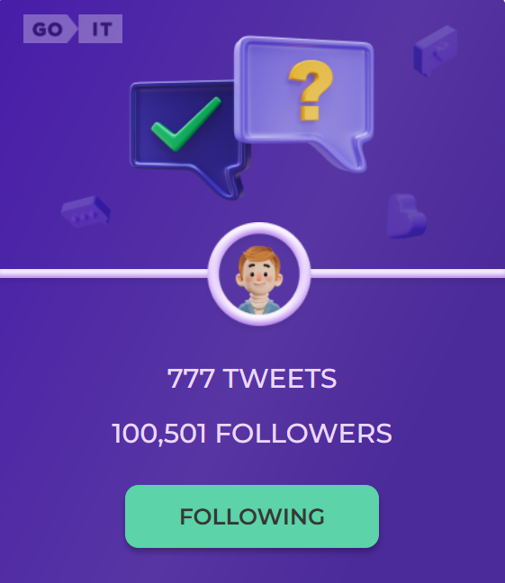

This is Test task from GoIT academy

Goal: Create a card for a single tweet and add click-through interactivity
button.

When you click on the Follow button, its text changes to Following. Also
the color of the button changes. And yours is added to the number of followers.

